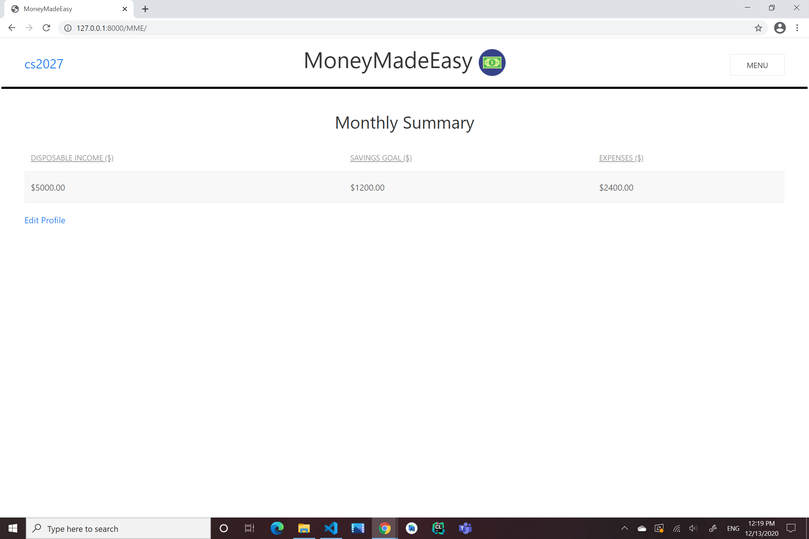
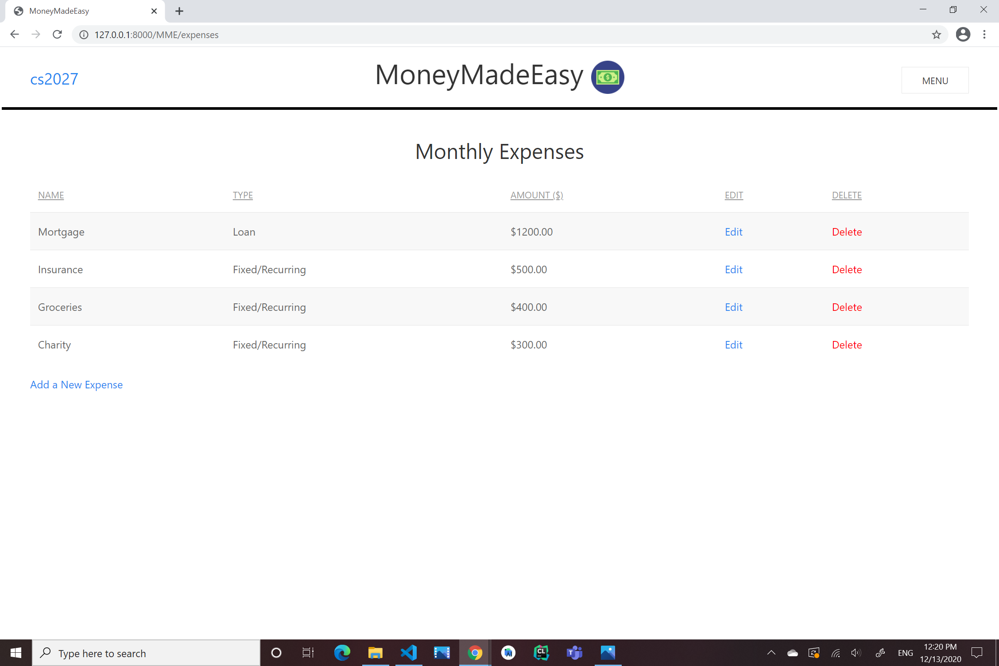
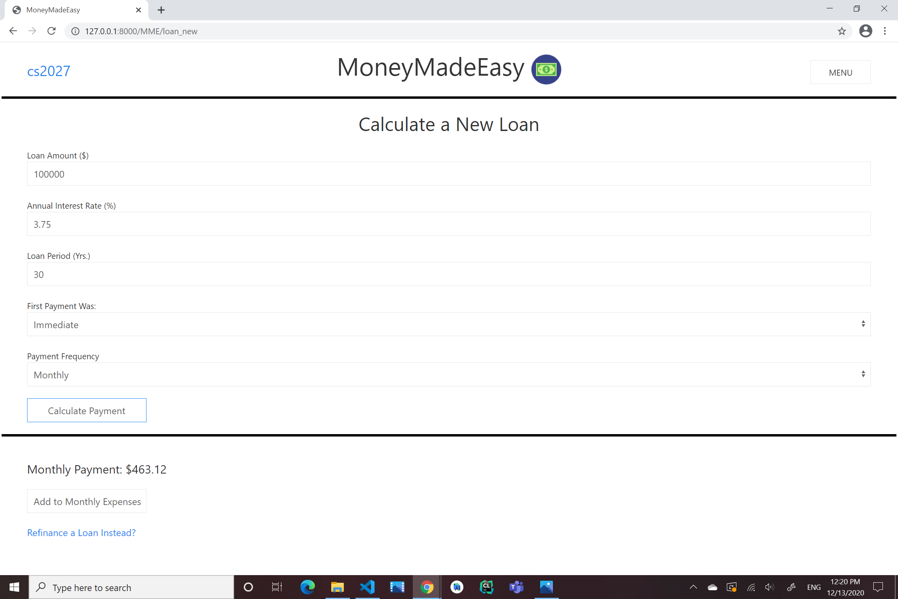
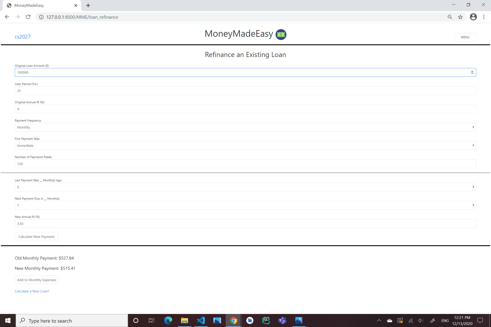
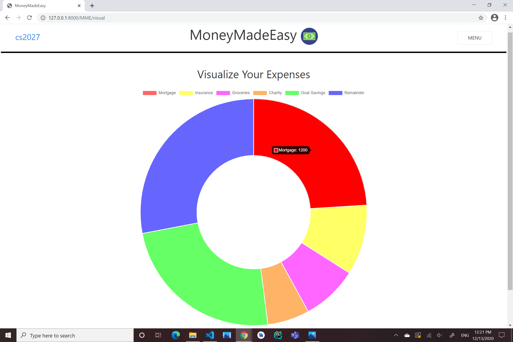

# MoneyMadeEasy

## Description
MoneyMadeEasy is a Django web application that serves as a personal budgeting tool. Users can log their monthly expenses, enter their disposable income and savings goal, and visualize their budget in a UI-friendly 'donut' chart. Additionally, the application features two loan-related calculators: one for calculating payments on a new loan and another for refinancing an existing loan. This is intended to be useful for calculating mortgage payments, student loan debt, etc., allowing users to easily calculate and log their loan payments, in addition to their fixed monthly expenses, such as groceries and insurance. 

Built with: Python, HTML, JavaScript, CSS (langugaes) & Django, UIKit, Chart.js (frameworks)

## UI Demonstration

### Initial Landing Page

--------------------------------
### Monthly Expenses

--------------------------------
### Loan Calculators 

 

--------------------------------
### Budget Visualization

